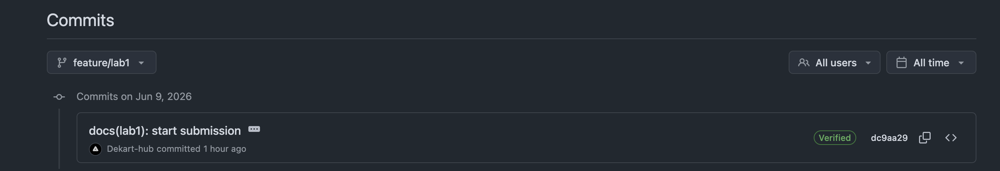

# Lab 1 submission

## Task 1

### Task 1.2
```
➜  DevOps-Intro git:(main) curl -s http://localhost:8080/health | python3 -m json.tool
{
    "notes": 4,
    "status": "ok"
}
➜  DevOps-Intro git:(main) curl -s http://localhost:8080/notes  | python3 -m json.tool
[
    {
        "id": 1,
        "title": "Welcome to QuickNotes",
        "body": "This is the project you'll containerize, deploy, monitor, and harden across all 10 labs.",
        "created_at": "2026-01-15T10:00:00Z"
    },
    {
        "id": 2,
        "title": "Read app/main.go first",
        "body": "Start by understanding the entry point \u2014 env vars, signal handling, graceful shutdown.",
        "created_at": "2026-01-15T10:05:00Z"
    },
    {
        "id": 3,
        "title": "DevOps mantra",
        "body": "If it hurts, do it more often.",
        "created_at": "2026-01-15T10:10:00Z"
    },
    {
        "id": 4,
        "title": "Endpoint cheat-sheet",
        "body": "GET /notes  GET /notes/{id}  POST /notes  DELETE /notes/{id}  GET /health  GET /metrics",
        "created_at": "2026-01-15T10:15:00Z"
    }
]
➜  DevOps-Intro git:(main) curl -s -X POST http://localhost:8080/notes \
  -H 'Content-Type: application/json' \
  -d '{"title":"hello","body":"first POST"}' | python3 -m json.tool
{
    "id": 5,
    "title": "hello",
    "body": "first POST",
    "created_at": "2026-06-09T14:42:24.397493Z"
}
```

### Task 1.4
```
commit dc9aa29c8643a2b7b6fe1ed452632ad6e038a9cd (HEAD -> feature/lab1, origin/feature/lab1)
Good "git" signature for 55945487+Dekart-hub@users.noreply.github.com with ED25519 key SHA256:4mgBS56IPmiiv9CfXkM7q5i3rb7LPWi6N5wlQfYCeVs
Author: Aleksandr <55945487+Dekart-hub@users.noreply.github.com>
Date:   Tue Jun 9 18:07:21 2026 +0300

    docs(lab1): start submission
    
    Signed-off-by: Aleksandr <55945487+Dekart-hub@users.noreply.github.com>
```

### Task 1.5


#### Why signed commits matter:
A signed commit attaches a cryptographic signature proving it was really made by the holder of a specific key, giving you verifiable provenance for every change. This is the class of trust problem the March 2024 xz-utils backdoor exposed.