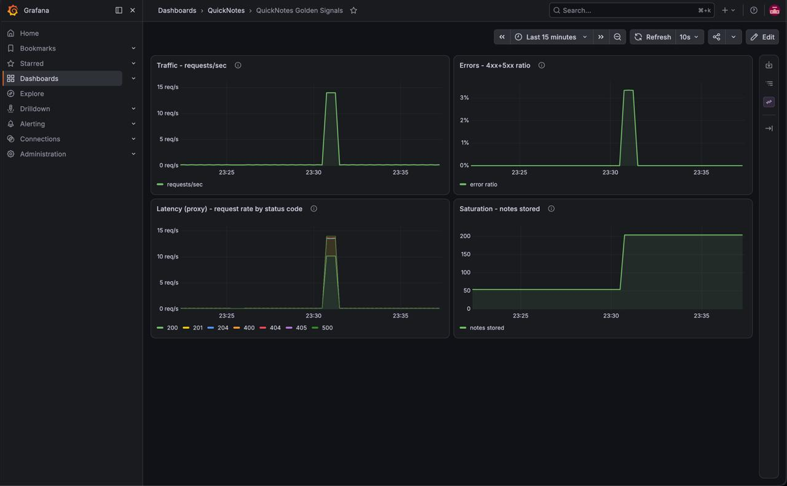
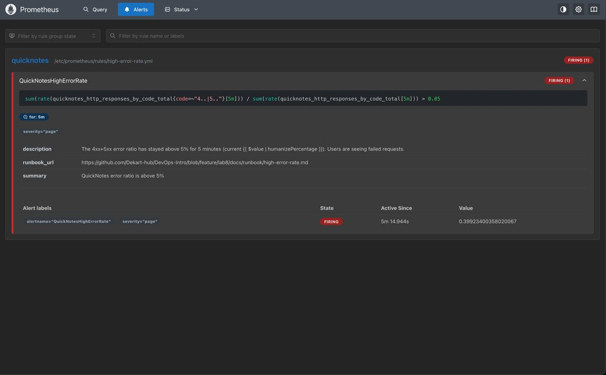
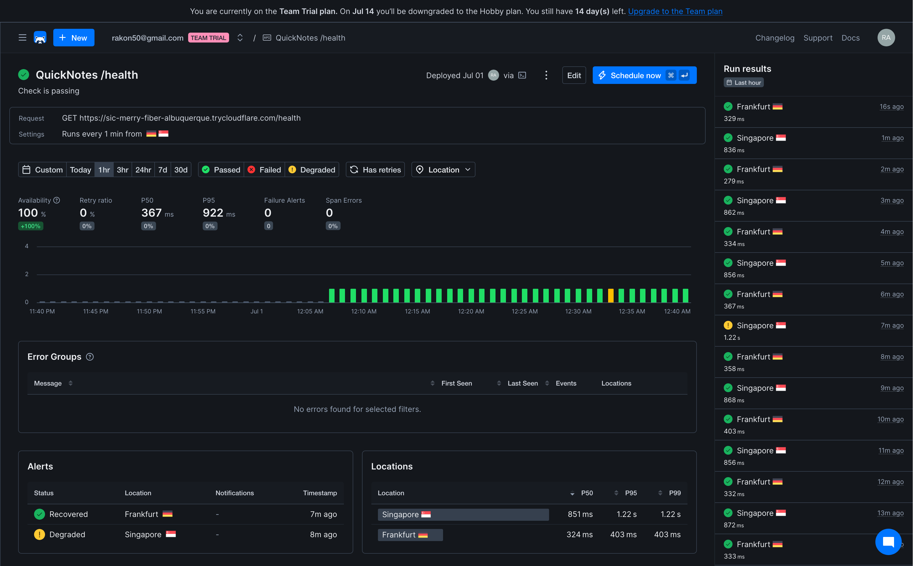

# Lab 8 - SRE and Monitoring: Golden Signals Dashboard + One Good Alert

## Objective

Add Prometheus and Grafana to the Lab 6 Compose stack, provision a four-panel
golden-signals dashboard from files, define one good error-rate alert with a
runbook, and (bonus) watch the deployed app from outside with a Checkly probe.

## Environment

- Host: Apple M4 (arm64), macOS; Docker 29.2.1, Compose v5.1.0
- Images (pinned, not `latest`): `prom/prometheus:v3.12.0`,
  `grafana/grafana:13.1.0`, QuickNotes built from `./app` as `quicknotes:lab6`
- QuickNotes already exposes `/metrics` in Prometheus format, so no app code
  changed. Available series:
  - `quicknotes_http_requests_total` (counter, all requests)
  - `quicknotes_http_responses_by_code_total{code}` (counter, per status code)
  - `quicknotes_notes_total` (gauge), plus created/deleted counters
  - No request-duration histogram is exposed (this drives the Latency panel
    choice below).

This branch starts from the Lab 6 container substrate (`app/Dockerfile`,
`app/cmd/healthcheck`, `app/.dockerignore`, `compose.yaml`) because the stack
has to build and run; the monitoring stack is layered on top.

---

## Task 1 - Prometheus + Grafana with a provisioned dashboard

### Files

```text
monitoring/
  prometheus/
    prometheus.yml                       # scrape config + rule_files
    rules/high-error-rate.yml            # Task 2 alert
  grafana/
    provisioning/
      datasources/datasource.yml         # Prometheus, default, fixed uid
      dashboards/dashboard.yml           # file provider
      alerting/.gitkeep  plugins/.gitkeep
    dashboards/golden-signals.json       # the 4-panel dashboard
  scripts/
    generate-traffic.sh                  # ~200 mixed requests
    trigger-high-error-rate.sh           # sustained error injector (Task 2)
compose.yaml                             # extended with prometheus + grafana
.env.example                             # GF_ADMIN_PASSWORD placeholder (.env gitignored)
```

### prometheus.yml

```yaml
global:
  scrape_interval: 15s
  scrape_timeout: 10s
rule_files:
  - /etc/prometheus/rules/*.yml
scrape_configs:
  - job_name: quicknotes
    metrics_path: /metrics
    static_configs:
      - targets:
          - quicknotes:8080
```

The target is the Compose **service name** + the in-container port; Compose DNS
resolves `quicknotes` on the network.

### Grafana provisioning

`datasources/datasource.yml` - Prometheus, default, with a fixed uid so the
dashboard references it portably:

```yaml
apiVersion: 1
datasources:
  - name: Prometheus
    uid: quicknotes-prometheus
    type: prometheus
    access: proxy
    url: http://prometheus:9090
    isDefault: true
    editable: false
    jsonData:
      timeInterval: 15s
```

`dashboards/dashboard.yml` - file provider pointing at the mounted dashboard
directory:

```yaml
apiVersion: 1
providers:
  - name: quicknotes
    orgId: 1
    folder: QuickNotes
    type: file
    options:
      path: /var/lib/grafana/dashboards
```

The dashboard itself is `monitoring/grafana/dashboards/golden-signals.json`
(four panels). PromQL per panel:

| Panel | Signal | Query |
|--|--|--|
| Traffic | requests/sec | `sum(rate(quicknotes_http_requests_total[$__rate_interval]))` |
| Errors | 4xx+5xx ratio | `sum(rate(quicknotes_http_responses_by_code_total{code=~"4..\|5.."}[$__rate_interval])) / clamp_min(sum(rate(quicknotes_http_responses_by_code_total[$__rate_interval])),1e-9)` |
| Latency (proxy) | per-code req rate | `sum by (code) (rate(quicknotes_http_responses_by_code_total[$__rate_interval]))` |
| Saturation | notes stored | `quicknotes_notes_total` |

QuickNotes exposes no request-duration histogram, so per the lab the **request
rate stands in as the Latency proxy** (shown broken down by status code). The
Errors panel has a red threshold drawn at 0.05 (the alert line).

### Compose extension

`prometheus` (depends_on `quicknotes: service_healthy`, port 9090, config + rules
mounted read-only) and `grafana` (depends_on `prometheus`, port 3000,
provisioning + dashboards mounted read-only). The Grafana admin password is read
from a gitignored `.env`:

```yaml
GF_SECURITY_ADMIN_USER: ${GF_ADMIN_USER:-quicknotes_admin}
GF_SECURITY_ADMIN_PASSWORD: ${GF_ADMIN_PASSWORD:?set GF_ADMIN_PASSWORD in .env (copy .env.example)}
```

The `:?` form makes `docker compose up` fail fast if the password is unset, so no
default credential is ever shipped (the lab's pitfall).

### Live verification

Stack up, traffic generated:

```text
$ docker compose up -d --build
  quicknotes  Up (healthy)   8080
  prometheus  Up             9090
  grafana     Up             3000   (db ok, v13.1.0)

$ ./monitoring/scripts/generate-traffic.sh
  sent 207 requests, 7 were 4xx/5xx (3%).
```

Target is UP (the lab's exact check):

```text
$ curl -s http://localhost:9090/api/v1/targets | jq '.data.activeTargets[].health'
"up"
# job=quicknotes instance=quicknotes:8080 scrapeUrl=http://quicknotes:8080/metrics
```

Golden-signal queries return non-trivial data:

```text
Traffic     sum(rate(quicknotes_http_requests_total[5m]))   = 0.822 req/s
Errors      4xx+5xx ratio                                    = 0.0287 (2.87%)
Latency     per code: 200=0.630 201=0.168 400=0.0067 404=0.0168 req/s
Saturation  quicknotes_notes_total                           = 54
```

Grafana auto-provisioned both the datasource and the dashboard, no provisioning
errors:

```text
$ curl -s -u $AUTH http://localhost:3000/api/datasources | jq -r '.[].name'
Prometheus                       (type prometheus, uid quicknotes-prometheus, default=true)
$ curl -s -u $AUTH "http://localhost:3000/api/search?type=dash-db" | jq -r '.[].title'
QuickNotes Golden Signals        (folder QuickNotes, 4 panels)
# grafana logs: provisioning clean (empty alerting/ + plugins/ dirs added to
# silence Grafana's missing-dir warnings)
```

**Screenshot:** Grafana dashboard *QuickNotes Golden Signals* after running
`generate-traffic.sh` - all four panels populated (traffic spike, error ratio
under the 5% line, per-code latency proxy, notes saturation climbing):



### Design answers

**a) Pull vs push.** Prometheus *pulls*, so the **target (QuickNotes) must be
reachable from Prometheus**, not the other way round. If Prometheus cannot reach
QuickNotes the scrape fails and `up == 0` for that target - QuickNotes keeps
serving users, only our visibility is lost. A bonus of pull: Prometheus owns the
schedule and turns "target unreachable" into an explicit `up == 0` signal, which
a push model cannot distinguish from "pusher simply went quiet".

**b) `scrape_interval`.** At `5s` you triple sample volume (storage, cardinality,
and scrape load on the app) for little gain on slow-moving signals, and short
`rate()` windows get noisier. At `5m` you go nearly blind to short incidents:
`rate()` needs >= 2 samples so your minimum usable window jumps to ~10-15m,
alerts react minutes late, and a dead target is noticed up to 5m late. 15s is the
sweet spot.

**c) `rate()` vs `irate()` vs `delta()`.** Traffic is a counter, so `rate()` -
the per-second average over the window, with counter-reset handling - is correct
and smooth enough for graphs and alerts. `irate()` uses only the last two
samples; it is too spiky for alerting. `delta()` is for gauges and does not
handle counter resets, so it is wrong here.

**d) Why provision from files.** A fresh `docker compose up` comes up fully wired
with zero clicks; the config is version-controlled, reviewed in PRs, and
identical on every machine. UI-clicked config is not reproducible, drifts between
environments, and is lost the moment the container is recreated.

---

## Task 2 - One good alert + runbook

### Alert rule (`monitoring/prometheus/rules/high-error-rate.yml`)

```yaml
groups:
  - name: quicknotes
    rules:
      - alert: QuickNotesHighErrorRate
        expr: |
          sum(rate(quicknotes_http_responses_by_code_total{code=~"4..|5.."}[5m]))
            /
          sum(rate(quicknotes_http_responses_by_code_total[5m]))
            > 0.05
        for: 5m
        labels:
          severity: page
        annotations:
          summary: QuickNotes error ratio is above 5%
          description: >-
            The 4xx+5xx error ratio has stayed above 5% for 5 minutes
            (current {{ $value | humanizePercentage }}). Users are seeing
            failed requests.
          runbook_url: https://github.com/Dekart-hub/DevOps-Intro/blob/feature/lab8/docs/runbook/high-error-rate.md
```

It carries `severity: page` and a `runbook_url` annotation. The 5m `rate()`
window plus the 5m `for` hold mean a single bad request or a short 4xx burst
never pages anyone. `promtool check rules` and `check config` both pass.

### Trigger and the Normal -> Pending -> Firing transition

`./monitoring/scripts/trigger-high-error-rate.sh` drives a sustained ~40% error
ratio (3 healthy reads + 1 malformed POST (400) + 1 missing note (404) per loop).
Captured timeline:

```text
19:31:31  BASELINE (no injection)   state=inactive  ratio=0      <- does NOT fire normally
19:31:51  el=0s                     state=inactive  ratio=0
19:32:51  el=60s                    state=pending   ratio=0.388  <- crossed 5%, Pending
   ...    (held Pending through the 5m "for")
19:38:58  el=427s                   state=FIRING                 <- fired
```

Firing alert (`curl -s localhost:9090/api/v1/alerts`):

```json
{
  "labels":      { "alertname": "QuickNotesHighErrorRate", "severity": "page" },
  "annotations": {
    "description": "The 4xx+5xx error ratio has stayed above 5% for 5 minutes (current 39.92%). Users are seeing failed requests.",
    "runbook_url": "https://github.com/Dekart-hub/DevOps-Intro/blob/feature/lab8/docs/runbook/high-error-rate.md",
    "summary":     "QuickNotes error ratio is above 5%"
  },
  "state": "firing",
  "activeAt": "2026-06-30T19:32:47Z",
  "value": "0.3992"
}
```

Response totals over the run: `200=22921 201=50 400=7520 404=7523 500=0`
(15043 of 38014 = ~39.6% errors, zero 5xx - the app itself never failed, the
errors were all client-side as injected).

**Screenshot:** Prometheus `/alerts` showing `QuickNotesHighErrorRate` in the
**Firing** state - `severity="page"`, the `runbook_url` annotation, active for
5m, value `0.399` (39.9%):



### Runbook

Full runbook: **`docs/runbook/high-error-rate.md`** (in this PR). It is written
for a 3 AM on-call who has never seen QuickNotes and has the four required
sections:

1. **What this alert means** - one sentence.
2. **Triage steps** - 4 ordered steps (confirm on the dashboard, break down by
   status code in Prometheus, check the service + logs, check for a recent
   change), with the exact PromQL and `docker compose` commands.
3. **Mitigations** - restart + check storage (5xx), cut off bad traffic (4xx),
   roll back a bad deploy.
4. **Post-incident** - write a blameless postmortem using the
   [Lecture 1 template](../lectures/lec1.md), blame systems not people, file the
   action items.

### Design answers

**e) Why sustained for 5 minutes.** Firing on the first bad request would page on
every transient blip - one fat-fingered client, a deploy hiccup, a single scrape
gap - which trains the on-call to ignore the pager. The 5m rate window plus 5m
`for` means we only page on a problem that has actually persisted and is hurting
real users.

**f) Symptom vs cause alerts.** Mine is a symptom alert (users are getting
errors). A cause alert for QuickNotes would be something like "disk > 90% full"
or "CPU > 80%". Cause alerts are worse because they page even when users are fine
(high CPU with no impact is pure noise), they only catch the failure modes you
thought to enumerate, and they multiply into many noisy rules. One symptom alert
catches *any* cause that actually reaches users and maps straight to the SLO.

**g) Alert fatigue threshold.** A page should be actionable almost every time. A
workable quantitative bar: if more than ~20% of pages fire when users were not
actually affected (precision below ~80%), the alert is too noisy and must be
retuned - raise the threshold, lengthen `for`, or alert on a better SLI. The SRE
Workbook frames this as keeping alert precision and recall both high.

---

## Bonus - Synthetic monitoring from the outside (Checkly)

Monitoring-as-code lives in `monitoring/checkly/` (`quicknotes.check.ts`,
`checkly.config.ts`, `package.json`, `README.md`). The check polls
QuickNotes `/health` from **two regions** (`eu-central-1` Frankfurt +
`ap-southeast-1` Singapore) **every 1 minute** and alerts on a non-200 status or
a response time over 2s. The public URL is read from `QUICKNOTES_URL` so the
ephemeral tunnel address is never committed.

### Public URL verified end to end

A cloudflared quick tunnel exposed QuickNotes publicly and it was reachable from
the internet (through Cloudflare's edge, no account needed):

```text
$ cloudflared tunnel --url http://localhost:8080
  https://icon-lan-provided-throws.trycloudflare.com   (edge: ham02)

$ curl https://icon-lan-provided-throws.trycloudflare.com/health
  {"notes":54,"status":"ok"}     HTTP 200   time_total=0.331s
$ curl .../metrics               HTTP 200   time_total=0.462s
```

### Internal vs external comparison

The Checkly check ran every minute for ~35 minutes from Frankfurt and Singapore
against the public tunnel URL. Both viewpoints over that window:

| Metric | Prometheus (inside the Compose net) | Checkly (Frankfurt + Singapore) |
|--|--|--|
| Latency p50 | ~1.1 ms (scrape_duration avg) | 367 ms (Frankfurt 324 ms, Singapore 851 ms) |
| Latency p95 | ~2.2 ms (no request histogram) | 922 ms (Frankfurt 403 ms, Singapore 1.22 s) |
| Errors observed | ~3% 4xx baseline by code, 0 5xx | 0 failures, 100% availability (1 Singapore probe degraded at 1.22 s) |



Internal "latency" here is Prometheus's own scrape duration (about 1 ms) - the
app exposes no request-duration histogram. External latency is two-plus orders of
magnitude higher because it includes DNS, TLS, the Cloudflare edge, the tunnel,
and the round trip from each region. The two regions also diverge sharply:
Singapore's p95 (1.22 s) is roughly 3x Frankfurt's (0.40 s) purely because of
distance to the Warsaw-edged tunnel, and one Singapore probe crossed the 1 s
"degraded" line - a geographic effect Prometheus, scraping from inside the
network, is completely blind to. Availability was 100% (no run breached the 2 s
hard-fail threshold).

### Failure-mode analysis

- **What Checkly catches that Prometheus cannot:** anything on the public path
  outside the Compose network - a DNS failure, an expired TLS certificate, the
  tunnel / ingress / load balancer being down, a regional network partition, or
  the host being offline. If the app is healthy but unreachable from the
  internet, Prometheus still reports `up == 1` while real users get nothing;
  Checkly sees the timeout from Frankfurt and Singapore.
- **What Prometheus catches that Checkly cannot:** per-endpoint and
  per-status-code detail and internal state - that 5% of `POST /notes` are
  failing while `/health` is green, or that `quicknotes_notes_total` is climbing
  toward saturation. Checkly only sees the black-box response of one endpoint at
  1-minute granularity from outside.
- Together they are the two halves of observability: external black-box ("is it
  up for users, anywhere?") plus internal white-box ("why, and where?").

---

## How to reproduce

```bash
cp .env.example .env            # then set a unique GF_ADMIN_PASSWORD
docker compose up -d --build
./monitoring/scripts/generate-traffic.sh        # ~200 mixed requests
# Prometheus  http://localhost:9090/targets   (quicknotes UP)
# Grafana     http://localhost:3000           (QuickNotes Golden Signals)
./monitoring/scripts/trigger-high-error-rate.sh # ~7 min -> alert goes Firing
# Alert       http://localhost:9090/alerts
docker compose down -v
```

Bonus: see `monitoring/checkly/README.md`.
